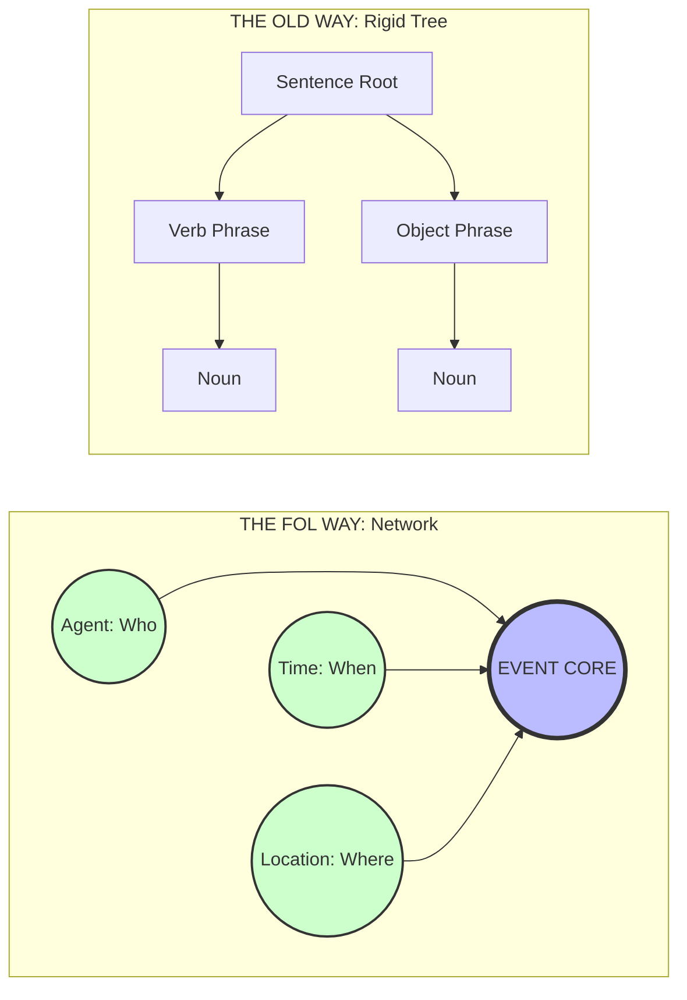

# Free-Order Logic
A minimalist logic design using Turkish morphology for free word order and strict state/identity separation.

---

> **Author's Note:**
> I am a linguistics enthusiast, not a professional compiler engineer. This project is a concept design exploring how Turkish grammar rules (agglutinative morphology) could be applied to code logic to make it smaller and more efficient. I am sharing this spec to get feedback on the logic, not to present a finished software product.

---

> **Note:** Diagrams illustrate structural hierarchy. For the official visual syntax and color-coding, see the "CMYK System" section below.

## 🚀 v0.2: The "Nomad" Update
**Logic in Motion.**

Free-Order Logic (FOL) is no longer just a specification. We have released a **Reference Interpreter (`poc.py`)** that proves the viability of suffix-based state resolution.

* **Run the Proof:** Use `python poc.py` to see the engine handle "scrambled" logic strings that traditional languages cannot parse.
* **Rule Validation:** This update provides a live demonstration of **Rule #1 (Order Independence)** and **Rule #5 (Compound Suffixes)**.
* **The Thesis:** By moving logic into the suffixes, we have successfully decoupled execution from the timeline.

## 💡 The Core Problem
In traditional programming, scope and relationship are defined by **position**.
* *Example:* `Parent { Child { Toy } }`
* If you lose a bracket, or if the data arrives in the wrong order, the logic breaks.

## 🛠 The Solution: "Hard Links"
This system uses suffixes (via **Dot Notation**) to "tag" arguments. This creates a hard link between data points, allowing them to exist anywhere in the stream without losing their relationship.

### Why Turkish Morphology?
Most programming languages are based on English syntax: `Subject -> Verb -> Object`. This requires strict ordering and creates "Race Conditions" when data arrives out of sequence.

Free-Order Logic (FOL) is bio-inspired by the agglutinative morphology of Turkish. In Turkish, meaning is encoded in suffixes (`Root` + `Suffix` + `Suffix`), allowing the words to be placed in any order without losing meaning.

* **English:** "I am going to school." (Order is fixed).
* **Turkish:** "Okula gidiyorum" OR "Gidiyorum okula." (Order is free).

FOL applies this "Nomadic Logic" to code. By moving the logic into the suffixes, we free the syntax from the timeline.

## 🚀 Why Free-Order Logic?

Traditional programming languages rely on rigid sequence and nested structures, which introduces three major classes of error. Free-Order Logic (FOL) addresses these architectural flaws at the syntax level:

### 1. The "Race Condition" Solution
**The Problem:** In standard code, if Data A arrives before Data B, the system crashes.
**The FOL Fix:** **Order Independence.**
Because FOL parses tokens based on tags (`.s`, `.t`) rather than position, data can arrive in any order—or simultaneously—without causing a deadlock. The logic remains valid regardless of sequence.

### 2. The "Off-By-One" Solution
**The Problem:** Looping errors (counting 0 to 9 instead of 10) are a leading cause of bugs.
**The FOL Fix:** **Category Addressing (Implicit Loops).**
FOL eliminates the need for manual counters. By addressing a Category (e.g., `Sensor.s`) rather than an Index (e.g., `Sensor[i]`), the command automatically applies to all valid entities. You cannot miscount if you never count.

### 3. The "Spaghetti Code" Solution
**The Problem
