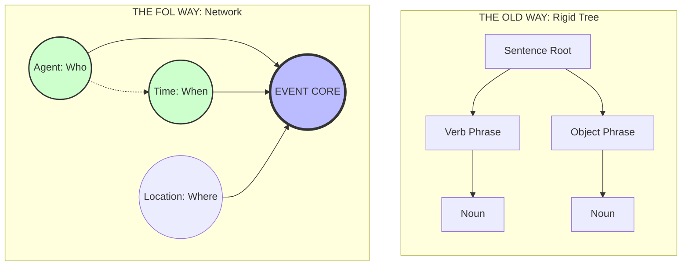

# Free-Order Logic
A minimalist logic design using Turkish morphology for free word order and strict state/identity separation.
---

> **Author's Note:**
> I am a linguistics enthusiast, not a professional compiler engineer. This project is a concept design exploring how Turkish grammar rules (agglutinative morphology) could be applied to code logic to make it smaller and more efficient. I am sharing this spec to get feedback on the logic, not to present a finished software product.

---


> **Note:** Diagrams illustrate structural hierarchy. For the official visual syntax and color-coding, see the "CMYK System" section below.

## 🚀 v0.2: The "Nomad" Update
**Logic in Motion.**

Free-Order Logic (FOL) [cite: 2026-01-20] is no longer just a specification. We have released a **Reference Interpreter (`poc.py`)** that proves the viability of suffix-based state resolution.

* **Run the Proof:** Use `python poc.py` to see the engine handle "scrambled" logic strings that traditional languages cannot parse.
* **Rule Validation:** This update provides a live demonstration of **Rule #1 (Order Independence)** and **Rule #5 (Compound Suffixes)**.
* **The Thesis:** By moving logic into the suffixes, we have successfully decoupled execution from the timeline [cite: 2026-01-20].

## 💡 The Core Problem
In traditional programming, scope and relationship are defined by **position**.
* *Example:* `Parent { Child { Toy } }`
* If you lose a bracket, or if the data arrives in the wrong order, the logic breaks.

## 🛠 The Solution: "Hard Links"
This system uses suffixes (via **Dot Notation**) to "tag" arguments. This creates a hard link between data points, allowing them to exist anywhere in the stream without losing their relationship.

It works like Turkish grammar: meaning is glued to the word itself, so the sentence structure can be flexible.


## 🚀 Why Free-Order Logic?

Traditional programming languages rely on rigid sequence and nested structures, which introduces three major classes of error. Free-Order Logic (FOL) addresses these architectural flaws at the syntax level:

### 1. The "Race Condition" Solution
**The Problem:** In standard code, if Data A arrives before Data B, the system crashes.
**The FOL Fix:** **Order Independence.**
Because FOL parses tokens based on tags (`.s`, `.t`) rather than position, data can arrive in any order—or simultaneously—without causing a deadlock. The logic remains valid regardless of sequence.

### 2. The "Off-By-One" Solution
**The Problem:** Looping errors (counting 0 to 9 instead of 10) are a leading cause of bugs.
**The FOL Fix:** **Category Addressing (Implicit Loops).**
FOL eliminates the need for manual counters. By addressing a Category (e.g., `Sensor.s`) rather than an Index (e.g., `Sensor[i]`), the command automatically applies to all valid entities. You cannot miscount if you never count.

### 3. The "Spaghetti Code" Solution
**The Problem:** Deeply nested functions (boxes inside boxes) create tangled, fragile code.
**The FOL Fix:** **Linear Tag Stacking.**
FOL replaces nesting with compound suffixes (e.g., `Object.s.void`). Logic is kept flat and linear, preventing the complexity of deep recursion.

## 🎨 Visual Syntax (CMYK)
The FOL system maps semantic logic to four distinct channels:

| Channel | Color | Role | Grammar Equiv. | Visual |
| :--- | :--- | :--- | :--- | :--- |
| **Entities** | 🟦 Cyan | **Nodes** | Nouns / Objects | Circles or Boxes |
| **Relations** | 💖 Magenta | **Edges** | Verbs / Actions | Arrows |
| **Context** | 🟡 Yellow | **Tags** | Adj / Adverbs | Highlights / Labels |
| **Structure** | ⬛ Key | **Logic** | Scope / Negation | Black Boxes / Lines |

> **Note:** Just like CMYK printing, these layers stack to create the full meaning.

### 🌉 The Universal Bridge (Glyph Independence)
Free-Order Logic is designed to be **language-agnostic**.

* **The "Glyphs" Don't Matter:** The specific English suffixes (`.s`, `.neg`, `.t`) are just placeholders. They can be swapped for any language's markers without changing the logic.
* **Universal Structure:** Because the system relies on *agglutinative morphology* rather than word order, the logic remains consistent across cultures.
* **The Result:** A developer in Tokyo and a developer in Istanbul can understand the same data packet's intent, even if they do not share a spoken language. The *logic* acts as the bridge.

### Standard Suffix Codes (Basic)
The system uses the following short codes to define roles:

| Suffix | Meaning | Logic Role |
| :--- | :--- | :--- |
| **.s** | **Subject** | The "Doer" or the main entity. |
| **.o** | **Object** | The receiver of the action. |
| **.p** | **Permanent** | Intrinsic properties (e.g., Color, Species) that **do not change**. |
| **.t** | **Temporary** | Volatile states (e.g., Mood, Location) that **change often**. |
| **.neg** | **Negation** | Inverts the meaning (Boolean NOT). |
| **.void** | **Unknown / Null** | Explicitly marks missing information without causing an error (Safe Null). |
| **.i** | **Item** | An inventory item or attribute attached to the Object. |
| **.l** | **Location** | Where the event takes place. |

### ⚡ Extended Suffixes (Advanced)
For more complex data streams (such as network packets or precise logic), the specification includes directional and logical modifiers:

| Suffix | Meaning | Logic Role |
| :--- | :--- | :--- |
| **.src** | **Source** | Origin point of the data (e.g., `Mars-Rover.src`). |
| **.dst** | **Destination** | Target recipient (e.g., `Earth-Station.dst`). |
| **.tm** | **Time** | Timestamp or duration (e.g., `1200.tm`). |
| **.via** | **Instrument** | The tool or method used (e.g., `Radio.via`). |
| **.q** | **Query** | Marks the data as a question/request. |
| **.if** | **Condition** | Marks a dependency (e.g., `Error.if Stop.s`). |
| **.dat** | **Dative** | The indirect object or recipient (e.g., `Server.dat`). |
| **.hz** | **Frequency** | The pitch or modulation of the signal (e.g., `Click.hz`). |
| **.echo** | **Strength** | Signal intensity, probability, or confidence level (e.g., `Weak.echo`). |
> **Note:** In production environments, these text suffixes are designed to be tokenized into integers (e.g., `.s` → `0x01`) to minimize packet size and optimize transmission speed.
---

## 📝 Logic Examples

### 1. The "Dog" Example (State vs. Identity)
*Standard Logic:*
`Subject: Dog, Properties: [Brown], State: [Angry]`

*Free-Order Logic:*
```text
Dog.s Brown.p Angry.t
```
Why this matters: The system separates .p (Identity) from .t (State).

Efficiency: In a data stream, you only need to send .p once.

Updates: You can continue sending tiny .t updates (e.g., Happy.t, Sleeping.t) without wasting bandwidth reiterating that the dog is brown.

## 2. The "Telescope" Example (Solving Ambiguity)

**The Problem:** Standard English is *ambiguous*. The sentence *"I saw the man with the telescope"* confuses computers. Did I use a telescope to see him? Or did I see a man who owns a telescope?

**The Solution:** FOL uses suffixes to lock the meaning to the word, creating mathematical certainty.

### Scenario A: The Telescope is the Instrument
`Man.o Telescope.i`
*(Translation: I used the telescope as an instrument to see him.)*

### Scenario B: The Telescope is a Property of the Man
`[Man Telescope.p].o`
*(Translation: The man with the telescope was seen by me.)*

**Why this matters:** By removing the ambiguity at the data level, the computer doesn't need to "guess" the context. It saves processing power and prevents logical errors in complex systems.
### ⏳ 3. Chronology (.tm)

Time is treated as a coordinate, not a linear sequence. Its function changes based on what it is attached to:

* **Duration (How Long):** When attached to a **State** (`.t`), `.tm` defines the length of that state.
    * `Sleep.t` `10m.tm` → *"Sleep for 10 minutes."*
* **Timestamp (When):** When attached to a **Command** (`.cmd`*), `.tm` defines the specific execution time.
    * `Wake.cmd` `0800.tm` → *"Wake up at 08:00."*

> *Note: Timestamps are absolute coordinates (like a meeting time), while State Durations are relative (like a timer).*

### 📚 4. Category Addressing

The system distinguishes between a specific ID and a generic Category to determine scope. Explicit "For-Loops" are not required.

* **Specific ID:** Targeting a unique name affects only that unit.
    * `Rose_Unit_4.s` `Water.cmd` → *"Water this specific rose."*
* **Category Name:** Targeting a class name affects **all** units of that type.
    * `Flower.s` `Water.cmd` → *"Water every flower."*

> **The "God Mode" Principle:** If no unique ID is provided, the command is applied universally to the Category.

### 🔗 5. Compound Suffixes (Stacking)

You are not limited to one suffix per word. Suffixes can be "stacked" to add layers of meaning to a single object. The system reads them from left to right.

* **Syntax:** `[Root][Suffix 1][Suffix 2]...`
* **Example:** `Cat.s.void`
    * `Cat` (Root Idea)
    * `.s` (Role: This is the Subject)
    * `.void` (State: The subject is missing/unknown)

**Why use this?**
Stacking reduces packet size by combining Identity (`.s`) and State (`.t` or `.void`) into a single token.

> `Motor.s.hot.t` → *"The Motor (Subject) is Hot (State)."*

### 🎮 Practical & Everyday Applications
Beyond theory, this design offers immediate solutions for software optimization:

### 1. Game State Optimization (NPCs)

The Problem: Open-world games suffer from "save file bloat" because they track thousands of characters.

The Solution: Using the Identity.p / State.t split, the game engine doesn't need to re-save the entire character. It only records the tiny suffix changes (e.g., Villager.t.sad). This drastically reduces memory usage.

### 2. Local-First Smart Home Control

The Problem: Most smart devices rely on the cloud to "guess" commands, creating lag and privacy risks.

The Solution: Because this syntax is unambiguous, it can be processed locally on a chip. A smart light wouldn't need internet to understand Light.o Kitchen.l On.t—creating a faster, private, offline network.

### 3. Poly-Hierarchical Organization (The "Tag" File System)

The Problem: Traditional file systems force an item to be in only one "Folder" at a time.

The Solution: This logic treats location as an attribute. A single file can possess Work.tag, 2025.tag, and Ideas.tag simultaneously, allowing it to exist in multiple places without duplication.

### 4. Legal Smart Contracts
A contract clause stating that subletting is strictly forbidden (Negated).
`Tenant.s  Property.o  Sublet.neg  Consent.t  Required.t`

### 5. Supply Chain Logistics
Tracking a container that is currently being inspected at a specific port location.
`Container_X.s  Port_Rotterdam.l  Customs.o  Inspect.t  Flagged.t`

### 6. Offline Hospital Triage
A field nurse logs a patient with a critical penicillin allergy while the tablet is offline.
`Patient_45.s  Conscious.t  Pulse_Weak.t  Penicillin.neg  Morphine.o  Administered.t`

### 🔮 Theoretical Domains
The logic of Hard Links and State Separation was designed with specific high-stakes environments in mind:

### Low-Bandwidth Communication (Space/IoT): 
By distinguishing between Permanent (.p) and Temporary (.t) data, systems avoid re-transmitting static information, saving massive amounts of bandwidth in deep-space transmissions.

### Asynchronous Data Streams: 
In systems where data packets might arrive out of order (like distributed networks), this system rebuilds the logic perfectly without waiting for a specific sequence.

### Bio-Digital Interfaces (BCI): 
Neural signals are often non-linear "clouds" of data rather than structured sentences. A "Free-Order" syntax is theoretically better suited for interpreting neural input, as it can construct meaning regardless of the sequence.

## ⚛️ Quantum & Low-Bandwidth Readiness

Free-Order Logic is designed for **Quantized Environments**—systems where data precision is lost (due to compression) or states are ambiguous (quantum superposition).

* **Safe Null States:** The `.void` suffix handles "missing" variables as valid states rather than errors.
* **Probabilistic Logic:** The `.echo` suffix (Signal Strength) allows for non-binary values ("Probable"), enabling fuzzy logic.
* **Superposition Support:** Because tags are independent, multiple contradictory states can be assigned to a single subject simultaneously.

**Example: Modeling a Qubit**
The system can model a qubit in "superposition" (Spinning Up and Down at the same time) before it is measured:

> `Qubit_Alpha.s` `SpinUp.t` `SpinDown.t` `Superposition.t`

### 📋 FAQ (Frequently Asked Questions)
Q: Is this a programming language like Python or Java? 

A: No. It is a Data Serialization Protocol (like JSON or XML). It is a way to "package" information so it can be sent between systems with zero wasted space.

Q: Why use suffixes instead of word order? 

A: Because word order is "fragile". If a data packet arrives out of sequence in a low-bandwidth environment, a positional system breaks. By using Morphological Tagging (suffixes), every piece of data carries its own "ID badge". You can scramble the order and the meaning stays 100% intact.

Q: What is the benefit of splitting Identity (.p) and State (.t)? 

A: Efficiency. In standard coding, you often re-send static data over and over. In Free-Order Logic, you establish the Permanent Identity (.p) once, then only stream the Volatile State (.t) updates. This saves massive amounts of bandwidth for IoT and high-latency systems.

## 🚧 Project Status: Active Prototype
This project has graduated from a static specification to an active prototype. We now have a working **Reference Interpreter (`poc.py`)** that demonstrates the logical consistency of the suffix system in real-time. 

Feedback on suffix expansion and multi-state logic is still highly encouraged!

### HNY 2026! 🥂


